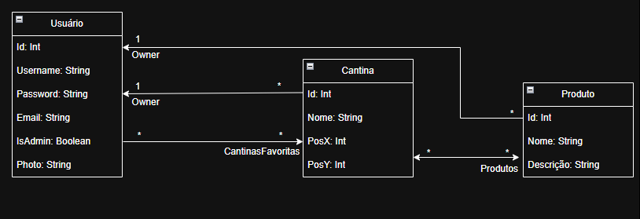

# Cantinas UFMG 📍

O **Cantinas UFMG** é uma aplicação web integrada ao Google Maps que auxilia estudantes da UFMG a descobrirem produtos e seus preços em lanchonetes e cantinas do campus Pampulha. Os usuários podem visualizar a localização das cantinas, consultar seus cardápios, avaliar serviços e manter uma lista de favoritos.

---

## Equipe

- **André de Filippo** – Back-end
- **Eduardo Klausing** – Back-end
- **Pedro Henrique Fernandes** – Front-end
- **Vitor Costa** – Front-end

---

## Funcionalidades

- Google Maps interativo com marcadores das cantinas.
- Login com permissionamento para usuários comuns e administradores.
- CRUD de lanchonetes e produtos (cardápio).
- Pesquisa de produtos com exibição das cantinas que os oferecem.
- Sistema de avaliação de lanchonetes e seus produtos.
- Lista de lanchonetes favoritas por usuário.

---

## Tecnologias

- **Front-end:** React + Material UI
- **Back-end:** ASP.NET Core (C#)
- **Banco de Dados:** PostgreSQL
- **Integração com Mapas:** Google Maps API

---

## Backlog do Produto

### 1. AUTENTICAÇÃO E PERMISSIONAMENTO (5)

**Como USUÁRIO**, quero poder criar uma conta para acessar o sistema  
_(Premissa: ADMINISTRADOR é cadastrado pela interface, mas precisa de alterações diretamente no banco - ou request específica)_

- T1: Configurar ambiente de WebApi
- T2: Definir banco de dados e framework de comunicação com o banco no C#
- T3: Configurar `.gitignore`
- T4: Criar tabela `usuario` (tipo 0 = normal, tipo 1 = administrador) e associar a uma classe no C#
- T5: Criar formulário de login
- T6: Criar formulário de cadastro de novo usuário

### 2. VISUALIZAÇÃO DO MAPA (3)

**Como USUÁRIO ou ADMINISTRADOR**, quero visualizar o mapa da universidade e ver as lanchonetes nele.

- T1: Criar ícones interativos sem o mapa inicialmente
- T2: Criar método na API para obter lista de todas as lanchonetes

### 3. CADASTRO DE LANCHONETES (3)

**Como ADMINISTRADOR**, quero cadastrar novas lanchonetes

- T1: Criar formulário para cadastro de lanchonete
- T2: Criar tabela `lanchonete` e classe correspondente
- T3: Criar métodos de inserção e consulta

### 4. CADASTRO DE PRODUTOS (2)

**Como ADMINISTRADOR**, quero cadastrar novos produtos

- T1: Criar formulário de cadastro de produto
- T2: Criar tabela `produto` e classe correspondente
- T3: Criar métodos de inserção e consulta

### 5. ADICIONAR PRODUTOS AO CARDÁPIO (3)

**Como ADMINISTRADOR**, quero adicionar produtos ao cardápio de uma lanchonete com seus preços

- T1: Criar classe de relacionamento Produto × Lanchonete
- T2: Criar CRUD desse relacionamento
- T3: Criar interface de seleção de produtos para cardápio

### 6. VISUALIZAÇÃO DE PRODUTOS DE UMA LANCHONETE (3)

**Como USUÁRIO ou ADMINISTRADOR**, quero visualizar os produtos de uma lanchonete no mapa

- T1: Criar endpoint GET
- T2: Criar modal com detalhes da lanchonete ao clicar no mapa

### 7. CONSULTA DE PRODUTOS (3)

**Como USUÁRIO ou ADMINISTRADOR**, quero pesquisar produtos e ver onde encontrá-los

- T1: Criar método de pesquisa por nome do produto
- T2: Criar barra de busca no front-end

### 8. AVALIAÇÃO DE LANCHONETES (3)

**Como USUÁRIO ou ADMINISTRADOR**, quero avaliar lanchonetes com notas de 1 a 5

- T1: Criar tabela `avaliacoes` com `usuario_id`, `lanchonete_id`, `nota`
- T2: Adicionar componente de avaliação com estrelas
- T3: Criar endpoints POST e GET

### 9. LISTA DE FAVORITOS (3)

**Como USUÁRIO ou ADMINISTRADOR**, quero favoritar lanchonetes e ver uma lista delas

- T1: Criar classe de relacionamento `Favoritos` (Usuário × Lanchonete)
- T2: Adicionar botão de favoritar/desfavoritar
- T3: Criar método para listar favoritos do usuário

---

## Diagrama UML



## Como Executar o Projeto

### Pré-requisitos

- Node.js 18+
- .NET SDK 7+
- PostgreSQL
- Conta Google para obter chave da API KEY do Google Maps

### Gerando uma API Key do Google Maps

```
# Acesse https://console.cloud.google.com/

# Crie um novo projeto ou selecione um já existente.

# Vá em APIs e Serviços > Biblioteca, ative a Maps JavaScript API.

# Vá em Credenciais > Criar credenciais > Chave de API.

# Copie a chave gerada e substituia o texto 'API_KEY_AQUI' no arquivo .env no diretório frontend

## Ou envie um email para pedrohfernandes2001@gmail.com com o assunto (CantinasUFMG - API Key) para mais instruções
```

### Front-end (React)

```bash
# Acesse a pasta do front-end
cd FrontEnd

# Instale as dependências
npm install

# Inicie o front-end
npm start
```

> A aplicação React será executada em http://localhost:3000

### Backend (ASP.NET Core)

```bash
# Instale o Visual Code com dependências para C# e ASPNET Core

# Execute o arquivo CantinasWebApi.sln presente dentro de \BackEnd
```

> O backend será executado em http://localhost:5287

## Observações finais

- Usuários administradores são cadastrados diretamente pela interface, mas precisam de uma requisição específica para possuírem o permissionamento correto.

  > Utilize a rota POST User/SetAdmin

- Execute o backend utilizando integração via HTTP - CORS (já configurado)
